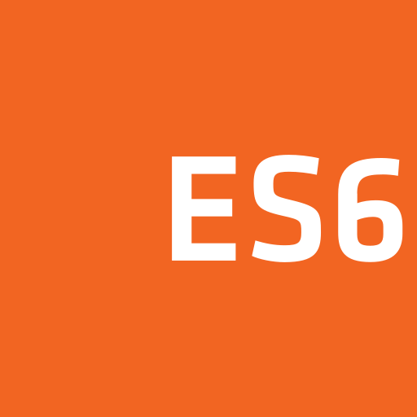

# Hi 👋, 
## This is scriptax
Constantly trying to learn web developement on both sides of frontend and backend.
I'm learning frontend technologies these days, Especially React.js. I'm also building a couple of small projects right now. Looking forward to spending more time on programming, here on Github. It's like a goldmine here!

### Frontend Technologies

  
  
  
  
  
  
  
  

### Tools

  
  

I'm on CodePen too. [My Profile](https://codepen.io/scriptax)
